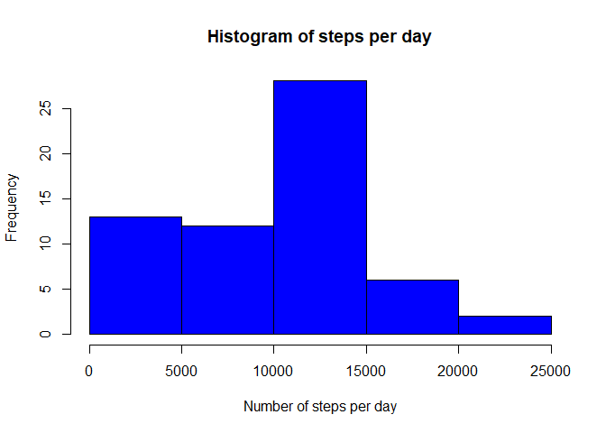
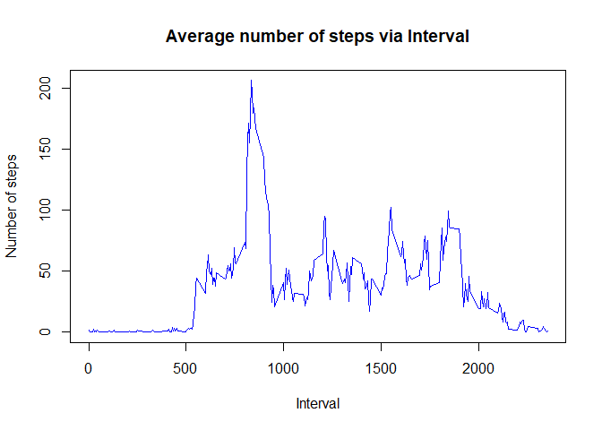
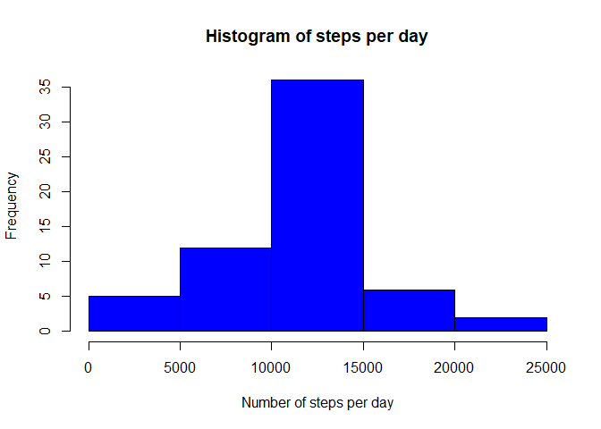
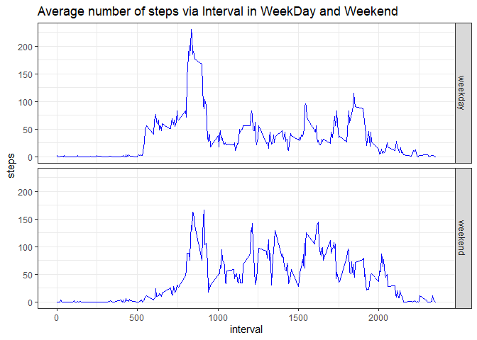

## Loading and preprocessing the data  

1. Load the data 


```r
    dat <-  read.csv("activity.csv")
    str(dat)
```

```
## 'data.frame':	17568 obs. of  3 variables:
##  $ steps   : int  NA NA NA NA NA NA NA NA NA NA ...
##  $ date    : chr  "2012-10-01" "2012-10-01" "2012-10-01" "2012-10-01" ...
##  $ interval: int  0 5 10 15 20 25 30 35 40 45 ...
```

```r
    head(dat)
```

```
##   steps       date interval
## 1    NA 2012-10-01        0
## 2    NA 2012-10-01        5
## 3    NA 2012-10-01       10
## 4    NA 2012-10-01       15
## 5    NA 2012-10-01       20
## 6    NA 2012-10-01       25
```

2. Convert variable 'date' from character type to Date type 


```r
    dat$date <- as.Date(dat$date)
    class(dat$date)
```

```
## [1] "Date"
```

## What is mean total number of steps taken per day?

1. Calculate the total number of steps taken per day


```r
    stepsperday <- dat %>%  group_by(date) %>% 
                            summarise(steps = sum(steps, na.rm = TRUE)) %>% 
                            pull(steps)
    head(stepsperday)
```

```
## [1]     0   126 11352 12116 13294 15420
```

2. Histogram of the total number of steps taken each day


```r
   hist(stepsperday, xlab = "Number of steps per day", 
                      main = "Histogram of steps per day", col = "blue")
```

<!-- -->

3. Mean and median of the total number of steps taken per day


```r
    mean(stepsperday, na.rm = TRUE)
```

```
## [1] 9354.23
```

```r
    median(stepsperday, na.rm = TRUE)
```

```
## [1] 10395
```

## What is the average daily activity pattern?

1. Series plot (type = "l") of the 5-minute interval (x-axis) and the average number of steps taken, averaged across all days (y-axis)


```r
    stepsperint <- dat %>% group_by(interval) %>% 
                            summarise(avg = mean(steps, na.rm = TRUE))
    with(stepsperint, plot(interval, avg, type = "l", col = "blue",
                             xlab = "Interval",
                             ylab = "Number of steps",
                             main = "Average number of steps via Interval"))
```

<!-- -->

2. The interval contains the maximum number of steps


```r
    m <- stepsperint[order(-stepsperint$avg),1][1,1]
    as.numeric(m)
```

```
## [1] 835
```

## Imputing missing values

1. Total number of missing values in the dataset


```r
    sum(!complete.cases(dat))
```

```
## [1] 2304
```

2. Create a new dataset that is equal to the original dataset but with the missing data filled in.


```r
    intervals <- unique(dat$interval)
    for (x in intervals) {
        dat[dat$interval == x, "steps"][is.na(dat[dat$interval == x, "steps"])] =
          mean(dat[dat$interval == x, "steps"], na.rm = TRUE)
    }

    head(dat)
```

```
##       steps       date interval
## 1 1.7169811 2012-10-01        0
## 2 0.3396226 2012-10-01        5
## 3 0.1320755 2012-10-01       10
## 4 0.1509434 2012-10-01       15
## 5 0.0754717 2012-10-01       20
## 6 2.0943396 2012-10-01       25
```

3. Make a histogram of the total number of steps taken each day and Calculate and report the mean and median total number of steps taken per day.


```r
     sum(!complete.cases(dat))
```

```
## [1] 0
```

```r
     stepsperday2 <- dat %>% group_by(date) %>% 
                            summarise(steps = sum(steps)) %>% 
                            pull(steps)
     hist(stepsperday2, xlab = "Number of steps per day", 
                        main = "Histogram of steps per day", col = "blue")
```

<!-- -->


```
## [1] "Mean of steps per day with missing data set:9354.23"
```

```
## [1] "Mean of steps per day with filled data set:10766.19"
```

```
## [1] "Median of steps per day with missing data set:10395.00"
```

```
## [1] "Median of steps per day with filled data set:10766.19"
```

## Are there differences in activity patterns between weekdays and weekends?

1. Create a new factor variable in the dataset with two levels – “weekday” and “weekend” indicating whether a given date is a weekday or weekend day.


```r
    dat <- dat %>% mutate(wday = if_else(weekdays(date, abbreviate = TRUE) %in%
                                           c("Sat", "Sun"), "weekend", "weekday"))
    dat$wday <- factor(dat$wday)
```

2. Make a panel plot containing a time series plot of the 5-minute interval (x-axis) and the average number of steps taken, averaged across all weekday days or weekend days (y-axis).


```r
    df <- dat %>% group_by(interval, wday) %>% summarise(steps = mean(steps))
    g <- df %>% ggplot(aes(interval, steps))
    g + geom_line(col = "blue") + facet_grid(wday~.) + theme_bw() + 
      ggtitle("Average number of steps via Interval in WeekDay and Weekend")
```

<!-- -->

